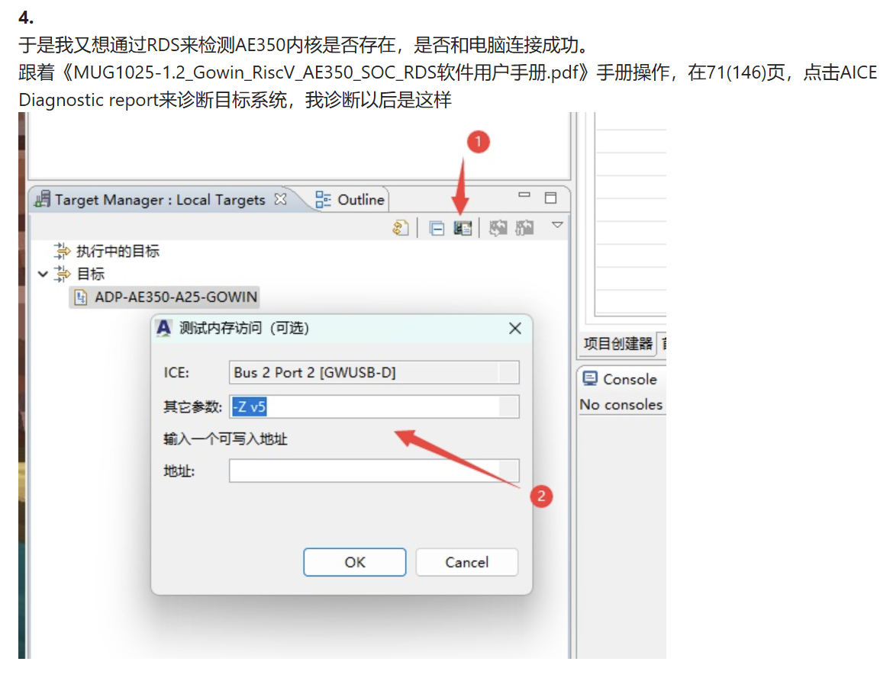

# GOWIN-138K-AE350  

## 📝 简记  
学校里买的都是 **Tang Mega 138K** 板子，既然是138K，那肯定要玩一下这个RISC-V，所以就尝试了把 **Tang Mega 138K Pro** 的 **ae350_demo** 工程移植到Gowin（高云）138K第三方开发板。总的来说还行，用起来不会太差（可能是MSPM0G3507的寄存器也差不多难用），至少做一下电赛的一些显示、FPGA通信，用一下TFT屏幕、按键、DSP什么的都可以，更深入的也懒得深挖，当个没什么资料的RV单片机绝对没什么问题。 -2025.4.7 凌晨 于宿舍

## 📖 简介  
**描述**：使用Gowin（高云）138K第三方开发板移植 Tang Mega 138K Pro `ae350_demo`工程  
**参考**：  
- [RiscV AE350 SOC](https://www.gowinsemi.com.cn/prodshow_view.aspx?TypeId=70&Id=189&FId=t31:70:31)  
- [RiscV_AE350_SOC_V1.3](https://www.gowinsemi.com.cn/prodshow_view.aspx?TypeId=70&Id=189&FId=t31:70:31)  

## 🎫 板卡  
| **板卡型号** | **描述** | **链接** |  
|--------------|----------|----------|  
| **GW138_060B** | 基于GW138_060A重新调整的开发板 | [GW138_060B](https://github.com/Aniline47/GW138_60K/tree/main) |  
| **GW138_060A** | 基于Tang Mega 138K/60K二次开发 | [GW138_060A](https://bigpig.ongridea.com/h9wtn0) |  
| **Tang Mega 138K** | 需改外设引脚，忍受BL616 JTAG低速烧录 | [Tang Mega 138K](https://wiki.sipeed.com/hardware/zh/tang/tang-mega-138k/mega-138k.html) |  

## 🖥️ 软件版本  
- **GOWIN FPGA Designer**: V1.9.11.01  
- **AndeSight_RDS**: v5.1.1  

## 🔌 引脚约束  
> **提示**：`.cst` 文件自行查看，无需在此列出  

## 🛠️ 移植教程  
### **步骤详解**  
1. **工程修改**  
   - 更改板型为 **GW5AST-LV138PG484AC1/I0 B**  
   - 重建所有IP核并替换  
   - 根据板子调整引脚约束，编译后烧录到FLASH  

2. **程序使用方式**  
   - **FLASH烧录**：  
     - Bin文件路径：`Debug/output/` 或 `Release/output/` 
     - 配置示例：  
         
   - **调试运行**：  
     - 需双JTAG或拔插切换（(FPGA/AE350)FLASH下载JTAG与AE350调试JTAG不共用）  


3. **JTAG驱动配置**  
  - **问题**：无法识别AE350核心  
  - **问题链接**：[TangMega138K RiscV硬核AE350下载程序遇到的问题](https://maixhub.com/discussion/100631)  
  - **原因**：JTAG驱动问题，如图驱动无法识别AE350。  

  > **注意**：如果你只是想进行FLASH烧录而不是调试下载，可跳过此步骤和RDS的报错，直接进行闪存烧录。  

  - **无法识别AE350的驱动截图**：
    
  > 上图显示驱动是无法识别AE350的。  


  - **解决方案**：
    - 步骤1：使用[UsbDriverTool](https://visualgdb.com/UsbDriverTool/)将FTDI驱动改为 **libusb(WINUSB)**  
    - 操作示例：
      
     

     

      


  - **验证**：
    - 命令测试：  
    ```bash
    -Z v5  # 若输出"ALL PASS"则正常
    ```

    - 命令操作示例：
    

    - 正确输出日志：
    

4. **FPGA下载配置**  
   - 若下载.fs失败：  
     - 取消勾选 `using ft2xx driver`，选择WINUSB驱动  
       


## 🎮 测试外设  
### **官方外设（RiscV_AE350_SOC_V1.2）**  
| **外设** | **状态** | **备注** |  
|----------|----------|----------|  
| GPIO | ✅ | 正常 |  
| UART | ✅ | 正常 |  
| SPI | ⚠️ | 硬件SPI配置问题 |  
| RTC | ⚠️ | 时钟计时异常 |  
| DDR3 | ✅ | 正常 |  
| DSP | ✅ | 移植自`ae350_dsp` |  
| INTR | ✅ | 中断正常 |  
| LED | ✅ | 正常 |  
| PRINTF | ✅ | 正常 |  
| SCANF | ✅ | 正常 |  
| WDT_PIT | ✅ | 测试通过 |  
| WFI | ✅ | 测试通过 |  
| AHB | ✅ | 移植自`AHB_Slave_Bridge` |  
| AXI | ✅ | 移植自`AXI4` |  

### **个人移植（电赛适配）**  
- **软件SPI**：驱动1.44寸ST7789S TFTLCD屏 ✅  
- **双端RAM**：FPGA与RISC-V通信（基于AHB_Slave_Bridge示例） ✅  

### **待移植**  
- **DDS模块**：软件GPIO模拟（计划中）  
- **DDR3_Share**：暂不考虑（懒）  


## ❓ 常见问题  
| **问题** | **解决方案** |  
|----------|--------------|  
| **1. 为什么下载的代码不能直接烧录？** | 因为综合生成的临时文件夹未同步到GitHub，需用户克隆后自行编译生成下载文件。 |  
| **2. 为什么综合报错？** |   - 部分工程使用SV语法或复用IO口：<br>     ▸ 在 **Project → Configuration → Place&Route** 中勾选报错的复用IO选项；<br>     ▸ 或在 **Synthesize → General** 中选择 **SystemVerilog2017**。 |  
| **3. 为什么RISC-V AE350 SOC的printf无法输出小数？** | 参考 `ae350_dsp` 工程配置，移植相关代码以支持小数输出。 |  
| **4. 为什么下载后没反应，调试卡在start.S的循环中？** |   - 修改 `bsp\config\config.h`，将 `BUILD_MODE` 设为 `"BUILD_LOAD"`；<br>     ▸ 参考手册：[MUG1030-1.3快速开发手册](https://cdn.gowinsemi.com.cn/MUG1030-1.3_Gowin_RiscV_AE350_SOC%E5%BF%AB%E9%80%9F%E5%BC%80%E5%8F%91%E7%94%A8%E6%88%B7%E6%89%8B%E5%86%8C.pdf)；<br>     ▸ 配置截图：<br>        |  
| **5. FPGA工程编译太慢？** | 保留时序约束中的 `set_operating_conditions -grade c -model slow -speed 2 -setup -hold`，勿注释此行（个人踩坑经验）。 |  